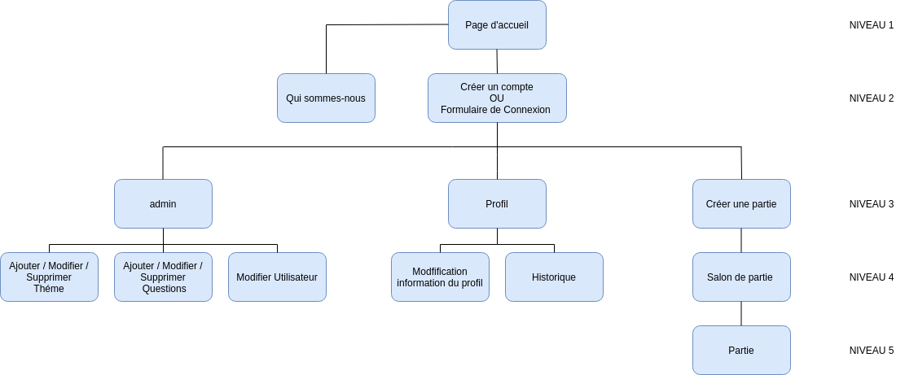

# Cahier des charges

## Présentation du projet
 
La crise du covid a donné un regain de popularité aux petits jeux multijoueurs (ex: gartic phone) et donc pour divertir les gens nous créeons ce site afin de permettre aux personnes de passer un bon moment entre amis en ces temps de crise.

Ce jeu a pour but de proposer des quizzes interactifs portés sur des questions d'ordre de grandeur. Les joueurs pourront s'inscrire sur le site, puis créer ou rejoindre une partie. Avant le lancement de la partie, les joueurs seront ensembles dans un salon où ils pourront parler entre eux via un tchat, et paramétrer les options de la partie (nombre de questions dans un round, nombre de rounds dans une partie, temps par question, nombre de joueurs max).

Lors de la partie, chaque joueur sera représenté par une barre de progression située au dessus de son pseudonyme. Une question sera proposée, un décompte sera lancé pour cette question, les joueurs auront ainsi un temps limité pour essayer de découvrir la bonne réponse. A l'issue du décompte, une autre question est proposée et ainsi de suite. A la fin de chaque question,  un système de points est attribué en fonctions des réponses validées par les joueurs.

Lors de la phase de réponse, les joueurs pourront modifier leurs réponses autant de fois que nécessaire dans le temps imparti. En fonction de ces réponses, leur barre de progression à l'écran évoluera (dans un premier temps, cette barre de progression sera indexée en fonction de la bonne réponse pour présenter un projet fonctionnel, par la suite en fonction de la moyenne des réponses des autres utilisateurs ou de la plus grande réponse des joueurs pour laisser plus de suspens). Une fois content de leur réponse, il leur suffira de la valider.
Si aucune réponse n'est proposée, le joueur ne marque pas de points.

A l'issue de la partie, un classement départagera tous les joueurs.

## Définitions des besoins/objectifs

En prenant comme référence ce qui se fait aujourd’hui et compte tenu de la crise sanitaire nous avons vu que de plus en plus de jeux ou site internet ayant comme base le jeu entre amis pour passer un bon moment, rigoler, se charrier, etc était de mise.
Nous avons eu du coup comme idée de créer un site web, à l'instar du fameux Gartic Phone (https://garticphone.com/fr) par exemple, sur un principe de quiz exclusivement de comparatif de taille car nous avons trouvé ceci fun et que cela permet de toujours apprendre des petites anecdotes ( toujours plaisant à ressortir lors d’une discussion entre amis).

L’objectif de ce projet étant de travailler sur quasiment l'ensemble des technos et connaissances qui nous ont été apprises durant la formation (et bien plus encore) ainsi que pour les clients : de passer un bon moment entre amis.

## Fonctionnalités du projet

### MVP

Structure de base:
- Accueil
- Authentification
- Profil
- Jeu
- Header
- Footer

Header:
- Logo
- Titre
- Menu

Footer:
- copyright
- Lien page 'Qui sommes-nous?'

Authentification:
- Création de compte
- Attribution des rôles
- Connexion d'un utilisateur

Profil:
- Accès aux informations personnelles
- Modification des informations personnelles
- Historique des parties

Admin:
- Modifier/Supprimer/Ajouter une question
- Modifier/Supprimer/Ajouter un thème
- Changer le rôle d'un utilisateur

Jeu:
- Créer une partie :
    - Génère un code copiable (avec un bouton pour possiblement le copier)
- Rejoindre une partie
- Accèder au salon de la partie

Tchat:
- Dialoguer avec les joueurs présents dans le salon de la partie
- Dialoguer avec les joueurs une fois le jeu lancé

Fonctionnalités de base du jeu:
- Décompte de 20secondes pour chaque question
- 10 questions par partie
- A chaque fin de décompte, on passe à une question suivante, le décompte se réinitialise
- Système de barre de progression inhérente à chaque joueur. Celles-ci évoluent en fonction de la réponse du joueur. Pour démarrer, la progression sera indexée sur la bonne réponse. 
- Score de la partie
- Affiche le pseudo des joueurs sous la barre
- Bouton 'Quitter la partie'
- Système de score:
    - Si un joueur trouve la bonne réponse, bonus de points (10points)
    - Sinon:
        - Le plus proche gagne 5points
        - le second gagne 4points
        - le troisième gagne 3 points
        - les autres n'ont pas de points
- Si la réponse n'est pas validée, mais que le joueur a eu le temps de proposer une réponse, la dernière réponse est validée
- Si aucune réponse n'a été proposée, le joueur ne marque pas de points

### Evolutions potentielles

#### Jeu

Animations :
- Timmer qui grossit quand il reste plus beaucoup de temps afin de rajouter du stress,
- Animations générales sur les boutons du site (hover, etc),
- Animation de chargement de partie,
- Messages de pression quand le timmer se rapproche de la fin,
- Animations des barres de progression,

Partie:
- Barre de progression, qui sera indexée en fonction de la moyenne des réponses ou de la plus grande réponse des joueurs

Salon de partie:
- Personnalisation de la partie (nombre de questions dans un round, nombre de rounds dans une partie, temps par question, nombre de joueurs max)
- Thèmes: 
    - choix par thème classiques 
    - aléatoire complet qui regroupe toutes les questions de tout les thèmes
    - aléatoire par thèmes (système de roulante en présentation visuel par exemple) 
    - sytème de vote pour un thème ou  une fonction (aléatoire, etc) en particulier
- Possibilité de personnalisation de l'avatar

Mode de jeux : 
- mode speed (10s au timmer, barre de progression des joueurs indéxée sur la bonne réponse, le but est de la trouver le plus vite possible) 
- mode Heroes(chaque joueur dispose d'un super pouvoir (aléatoire) utilisable une seul fois pendant toute la durée de la partie (ex: affichage barre de progression aléatoire, pas de vue des barres de progression des autres joueurs, possibilité d'enlever 15s au timmer à l'enssemble des joueurs ou qu'a un seul joueur, échanger sa réponse avec un joueur, voir les réponses des joueurs ayant confirmer avant la fin du chrono, etc)

Option de sons : 
- activer ou désactiver le son (background sonore / son des notif, ex:timer, efect...10s) 

IA pour partie local: 
- développer une IA permettant de jouer en local contre une ou plusieurs IA avec un choix de difficultés (facile, difficile, expert)

- Lien page contact

#### Structure/Divers

Authentification : 
- Connexion par compte Facebook / Google
-  mot de passe oublié 

Admin:
- Banissement d'utilisateurs

Tchat:
- Message privés
- tchat disponible sur tout le site (pas uniquement que Salon de partie/En jeu)

Profil:
- Liste d'amis
- Image de profil
- Suppression de compte

Contact: 
- permet à un visiteur ou bien un user d'envoyer sous forme de mail une requête concernant un avis, un bug, etc 

Avis: 
- chaque user peut donner un avis avec une note 

Mode d'affichage :
- mode nuit pour avoir l'interface web en sombre
  
Réseaux sociaux : 
- compte Discord/Instagram/Facebook/Youtube/Twitch/...

## Liste des technologies utilisées pour le projet

### Front

- React 
- Redux
- Axios
- React-Router-Dom
- socket.io-client

### Back

-Nodejs
-Express
-Sqitch 
-Postgres
-Sequelize

## Définition de la cible

Ce projet vise tout public de tout âge (à partir de 12ans et plus).

## Navigateur Compatibles

Google Chrome / Mozilla Firefox / Safari / Edge

## Arborescence de l'application

## Liste des routes

### Back

Numero |   Endpoint                     | HTTP   | Données à transmettre                              | Description                     |
-------|--------------------------------|--------|----------------------------------------------------|---------------------------------|
1      |  /signin                       | POST   | email, password                                    | Récupération des données de connexion de l'utilisateur
2      |  /signup                       | POST   | email, password, pseudo                            | Création de compte d'un utilisateur 
3      |  /profil/[id]                  | GET    | id, email, pseudo                                  | Afficher les données de l'utilisateur connecté
4      |  /profil                       | POST   | email, password, pseudo                            | Modifier les données de son profil
5      |  /history/[id]                 | GET    | user_id, room, score, position, date               | Récupère l'id de l'utilisateur plus une fonction qui donnera des moyennes sur toutes les données de toute les games              |
6      |  /admin/question               | GET    | id, question, answer                               | Récupère toutes les questions
7      |  /admin/question/[id]          | GET    | id, question, answer                               | Récupère une seule question
8      |  /admin/question               | POST   | id_admin, password, question, answer, id_tag       | Ajout d'une nouvelle question/réponse, attachée à un thème existant
9      |  /admin/question/[id]          | PUT    | id, question, answer                               | Modifier une question/réponse
10     |  /admin/question/[id]          | DELETE | id, question                                       | Supprimer une question
11     |  /admin/tag                    | GET    | id, name                                           | Récupère tous les tags
12     |  /admin/tag/[id]               | GET    | id, name                                           | Récupère un tag en particulier
13     |  /admin/tag/[id]               | DELETE | id, name                                           | Supprimer un tag
14     |  /admin/tag                    | POST   | id_admin, name, password                           | Ajout d'un tag
15     |  /admin/user/[id]              | DELETE | user_id, pseudo                                    | Supprimer un utilisateur
16     |  /admin/question/[id]/tag/[id] | PUT    | id_question, id_tag                                | Modifier une appartenance d'une question / réponse à un thème
17     |  /admin/role                   | PUT    | user_id, role                                      | Modifier une appartenance d'une question / réponse à un thème

### Front

- Page d'accueil
- Modale de connexion
- Page Création de compte
- Page Admin
- Page Profil
- Page Création de Partie
- Page Salon de la partie
- Page de jeu
- Page "Qui-Sommes-Nous?"
- Page Contact
- Page gestion Erreurs

## Liste des User Stories

En tant que |   Je veux pouvoir                 | Afin de
------------|---------------------------------- |--------- 
admin       | Ajouter de nouvelles questions    |   Améliorer les Quizz et le plaisir de jeu
admin       | Modifier des questions/réponses existantes | Améliorer les Quizz et le plaisir de jeu
admin       | Supprimer de nouvelles questions  |   Améliorer les Quizz et le plaisir de jeu
admin       | Ajouter de nouveaux thèmes        |   Améliorer les Quizz et le plaisir de jeu
admin       | Supprimer des thèmes              |   Améliorer les Quizz et le plaisir de jeu
admin       | Changer le rôle d'un utilisateur  |   Créer ou supprimer de nouveaux admins
admin       | Se déconnecter                    |   
admin       | Consulter mon profil              |   Modifier mes informations personnelles

En tant que |   Je veux pouvoir                  | Afin de
------------|------------------------------------|---------
user        | Me connecter                       |  
user        | Se déconnecter                     |  
user        | Consulter mon profil               |  Modifier mes informations personnelles  
user        | Consulter mon historique de parties|  Me donner plus d'informations sur le résumé de mes parties
user        | Rejoindre une partie               |  Pouvoir jouer avec mes amis
user        | Quitter une partie                 |  
user        | Créer une partie                   |  Pouvoir jouer avec mes amis
user        | Utiliser le tchat                  |  Communiquer avec les personnes de la partie 

En tant que |   Je veux pouvoir                     | Afin de
------------|---------------------------------------|---------
visitor     |  Créer un compte                      | Pouvoir jouer  
visitor     |  Accèder à la page accueil            | Pouvoir regarder le tuto de fonctionnement de partie  
visitor     |  Accèder à la page création de compte | Pouvoir créer un compte  
visitor     |  Accèder à la page "Qui sommes-nous?" | Se documenter sur le site    

### Evolution potentielles user stories 

En tant que |   Je veux pouvoir                     | Afin de
------------|---------------------------------------|---------
admin       | Bannir des utilisateurs           |   Améliorer le plaisir de jeu 
admin       | Consulter la liste des messages reçus via contact | Lire les desideratas des utilisateurs
user        | Ajouter un ami                     |  Pouvoir jouer avec mes amis
user        | Supprimer un ami                   |  Améliorer mon plaisir de jeu
user        | Consulter sa liste d'amis          |  
user        | Rechercher un utilisateur (pseudo) |  Communiquer avec lui/ Ajouter à sa liste d'amis
user        | Accèder au formulaire de contact   |  Pouvoir reporter un bug ou faire remonter des informations liées à l'utilisation
user        | Déposer un avis                    |  Pouvoir donner son avis sur son utilisation du site

## Liste des rôles

- Arnaud Gueresse: **Product Owner**, **lead Dev Back**,
- Nicolas Mellinger: **Scrum Master**,
- Michaël Mittoo: **lead Dev Front**,
- Alexandre Bobichon: **Git Master**,