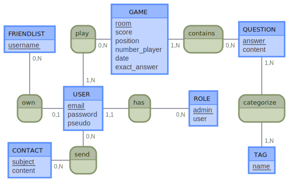

# MCD

## Evolutions potentielles

```
FRIENDLIST: username
play, 0N GAME, 1N USER
GAME: room, score, position, number_player, date,
contains, 1N GAME, 0N QUESTION
QUESTION: answer, content

own, 01 USER, 0N FRIENDLIST
USER: firstname, lastname, email, password, pseudo
has, 11 USER, 0N ROLE
ROLE: admin, user
categorize, 1N QUESTION, 1N TAG

CONTACT:  subject, content
send, 0N CONTACT, 0N USER
::
TAG: name
```

