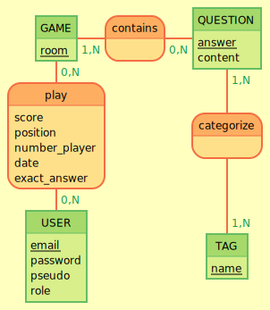

T# MCD
## Structure MVP

```
GAME: room
contains, 1N GAME, 0N QUESTION
QUESTION: answer, content

play, 0N GAME, 0N USER :score, position, number_player , date, exact_answer
:
categorize, 1N QUESTION, 1N TAG

USER:  email, password, pseudo, role
:
TAG: name
```




