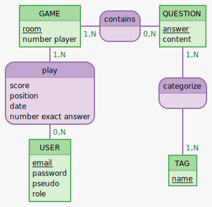

T# MCD
## Structure MVP

```
play, 0N GAME, 1N USER
GAME: room, score, position, number_player , date, exact_answer
contains, 1N GAME, 0N QUESTION
QUESTION: answer, content


USER:  email, password, pseudo
has, 11 USER, 0N ROLE
ROLE: admin, user
categorize, 1N QUESTION, 1N TAG


::
TAG: name
```




